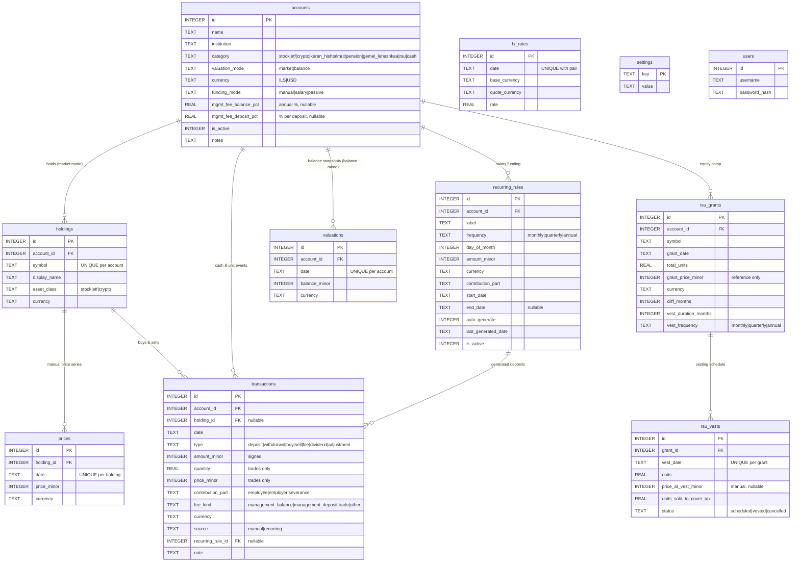

# Choopi Finance — database schema

SQLite, single user, entirely manual data entry. Nothing in this database is
fetched from a third party: every price, balance and FX rate is a number you
typed, so the schema treats them as **first-class dated series** rather than
caches of a feed.

## Ground rules

| Rule | Why |
|---|---|
| **Money is `INTEGER` minor units** (agorot / cents), suffixed `_minor` | `0.1 + 0.2 !== 0.3` in binary floating point. Totals must reconcile exactly, so money never touches `REAL`. |
| **Dates are `TEXT` `'YYYY-MM-DD'`**, guarded by a `GLOB` pattern | In this format text dates sort and compare chronologically, so `<=`, `BETWEEN` and `ORDER BY` work with no conversion. |
| **`REAL` only for genuine ratios** — `quantity`, `*_pct`, `fx_rates.rate` | 0.0123 BTC and 0.62 % are real-valued measurements, not money. |
| **Signs on `transactions.amount_minor` are enforced per `type`** | Makes `SUM(amount_minor)` meaningful without a `CASE` per row. |
| **`PRAGMA foreign_keys = ON`, `journal_mode = WAL`** | FK enforcement is per-connection and off by default; WAL lets the daily backup read while the app writes. |

## Entity relationships



`settings` (which holds `display_currency`, default `ILS`) and `users` (login
only) stand apart: no financial table carries a user id, because this is a
single-user app.

## The two valuation modes

`accounts.valuation_mode` is the axis the whole model turns on:

- **`market`** — worth = units held × the newest `prices` row on-or-before the
  date, **plus** uninvested cash. Units come from `buy`/`sell` transactions.
  Used for brokerage, crypto and RSU accounts.
- **`balance`** — worth = the newest `valuations` row on-or-before the date.
  Used for keren hishtalmut, pension and gemel lehashkaa, where the statement
  gives you one number and never a unit count.

Both are read with the same **carry-forward** shape:

```sql
SELECT … WHERE <fk> = ? AND date <= ? ORDER BY date DESC LIMIT 1
```

Which is why the indexes put the foreign key first and `date` second. `prices`,
`valuations` and `rsu_vests` get that ordering free from their `UNIQUE`
constraints; `fx_rates` does not (its `UNIQUE` starts with `date`), so it has an
explicit `idx_fx_rates_pair_date`.

## Sign convention

| type | sign | meaning |
|---|---|---|
| `deposit` | `> 0` | your money in |
| `withdrawal` | `< 0` | your money out |
| `buy` | `< 0` | cash converted into units |
| `sell` | `> 0` | units converted into cash |
| `dividend` | `> 0` | income received |
| `fee` | `< 0` | charged against the account |
| `adjustment` | either | correcting entry |

Enforced by `CHECK` constraints, so the aggregate queries below can trust them.

## Migrations

`server/migrations/NNN_name.sql`, applied in lexicographic order by
`src/db/migrate.ts`. Each file runs inside **one transaction owned by the
runner** — so migration files must not contain `BEGIN`/`COMMIT`, and a failure
rolls back completely and stays unrecorded, letting a fixed file re-run. Applied
files are fingerprinted: editing one that already ran is a hard error, not a
silent no-op.

```bash
npm run seed:demo     # wipe financial tables and insert realistic demo data
```
